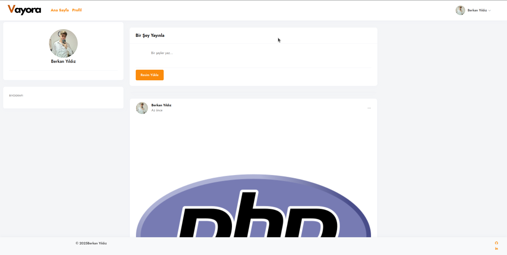
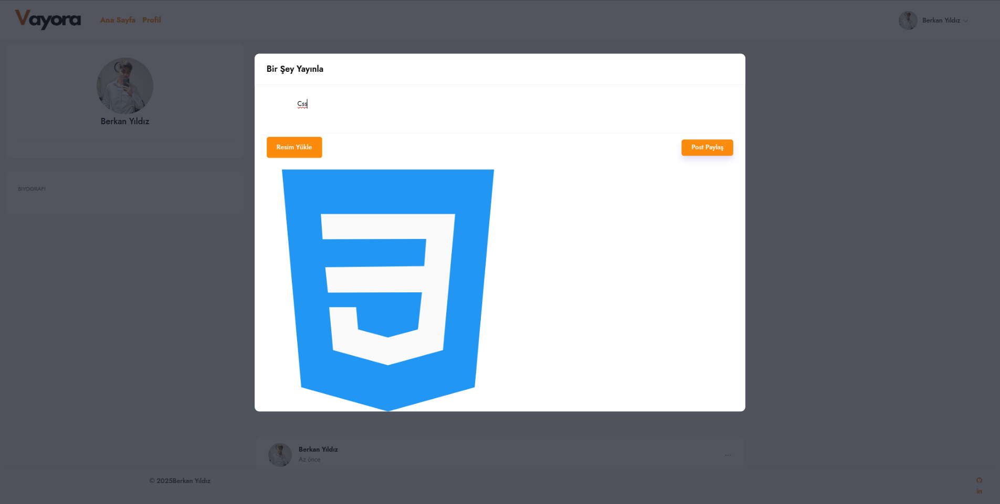
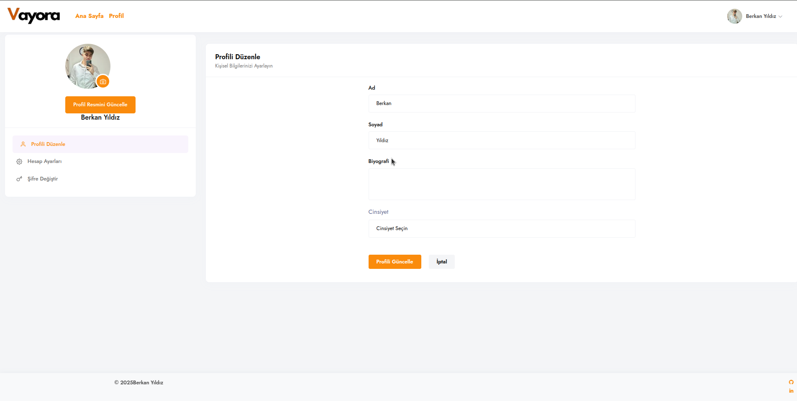
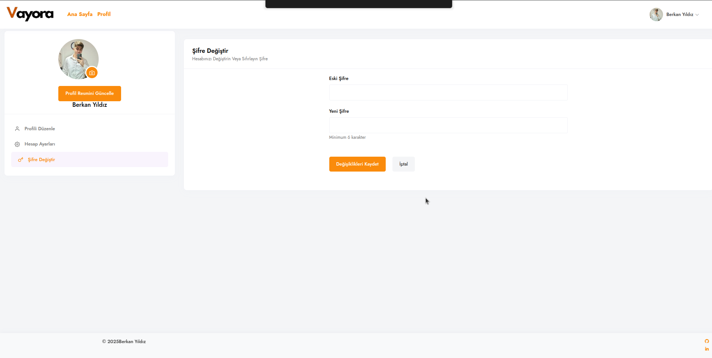

# Sosyal Medya Platformu - PHP Projesi

Bu proje, kullanıcı yönetimi, içerik paylaşımı ve kullanıcı etkileşimi gibi temel sosyal medya işlevlerini yerine getiren dinamik bir PHP tabanlı web uygulamasıdır. Kullanıcı dostu arayüzü ve güçlü işlevselliği sayesinde kullanıcıların modern bir sosyal medya deneyimi yaşamasını hedefler.

## 🚀 Özellikler

- ✅ Kullanıcı Kaydı ve Girişi
- ✅ Profil düzenleme (profil fotoğrafı, biyografi vb.)
- ✅ İçerik paylaşımı (metin, resim vb.)
- ✅ Gönderilere yorum yapma ve beğenme
- ✅ Kullanıcılar arası etkileşim
- ✅ Mobil uyumlu ve modern tasarım
- ✅ Gelişmiş hata kontrol ve oturum yönetimi

## 🛠️ Kullanılan Teknolojiler

| Teknoloji | Açıklama |
|----------|----------|
| **PHP** | Backend geliştirme |
| **MySQL** | Veritabanı yönetimi |
| **HTML/CSS** | Arayüz tasarımı |
| **JavaScript** | Dinamik etkileşimler |
| **Bootstrap** | Mobil uyumlu responsive tasarım |

## 📸 Ekran Görüntüleri

Ana Sayfa  

Kullanıcı Profili  

İçerik Paylaşımı  

Ayarlar Sayfası  

# my-socialhub
